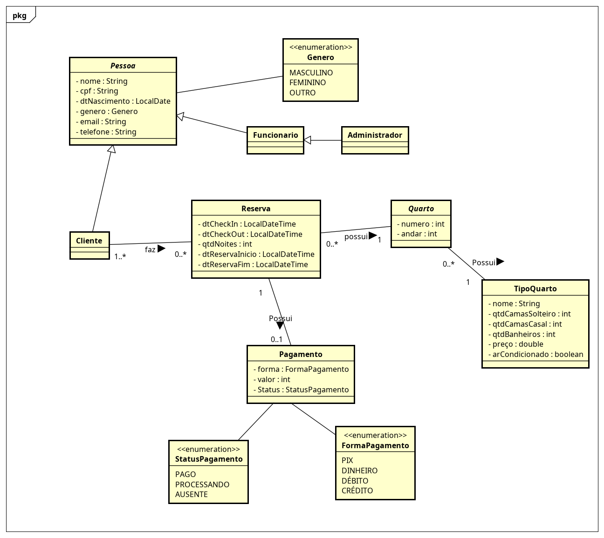

# SuaPousada.com - Sistema de gerenciamento de Pousadas
Repositório focado no desenvolvimento do projeto da matéria Projeto Integrado do curso de Ciência da Computaçao na ufes.
Feito por Bruno Vale, Rafael Rodrigues e Yuri Mutz.

## Diagrama de classes



## Ferramentas utilizadas

| Tipo               | Ferramenta      |
|--------------------|-----------------|
| Controle de versão | Git             |
| Build              | Maven           |
| Container          | Docker          |
| Testes             | JUnit e Mockito |
| Banco de dados     | PostgreSQL      |


## Frameworks Reutilizados

**Backend**
- Spring Boot
- Spring Data JPA
- Spring Web MVC

**Frontend**
- Tailwind CSS
- React

## Documentação do código (JavaDoc)

Para gerar a documentação, pasta rodar o comando (é necessário ter o Maven instalado):
```bash
mvn javadoc:javadoc
```
A documentação será gerada em HTML no diretório `target/reports/apidocs/`  

Basta abrir o arquivo `index.html` neste diretório para visualizar a documentação completa.


## Execução do Sistema

### Pré requisitos
- Possuir Docker instalado

### Execução

1. Fazer o build dos containers com o docker compose e subi-los. O docker contruirá os containers do Frontend, do Backend e do Banco de dados

```bash
docker compose build
docker compose up -d
```

### Acesso

Após a execução, basta acessar no navegador de sua preferência [http://localhost:5173](http://localhost:5173) 
